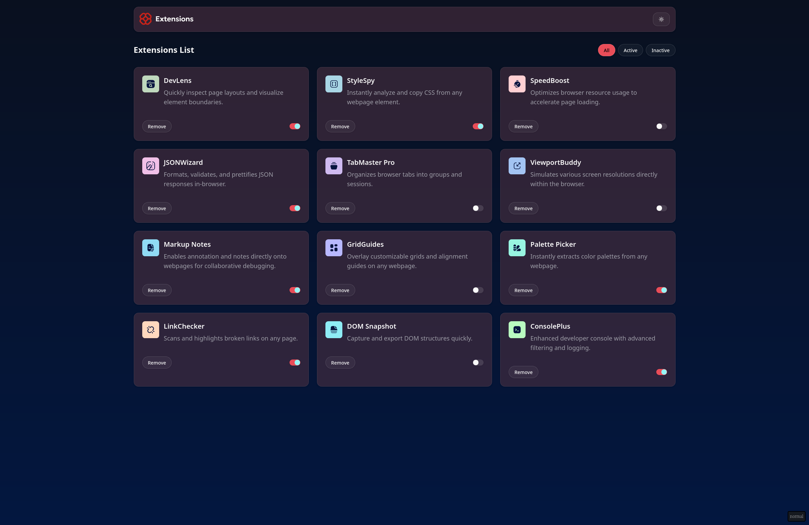

# Frontend Mentor - Browser extensions manager UI solution

This is a solution to the [Browser extensions manager UI challenge on Frontend Mentor](https://www.frontendmentor.io/challenges/browser-extension-manager-ui-yNZnOfsMAp). 

## Table of contents

- [Overview](#overview)
  - [The challenge](#the-challenge)
  - [Screenshot](#screenshot)
  - [Links](#links)
- [My process](#my-process)
  - [Built with](#built-with)
  - [What I learned](#what-i-learned)
  - [Continued development](#continued-development)
  - [Useful resources](#useful-resources)
- [Author](#author)
- [Acknowledgments](#acknowledgments)

## Overview

### The challenge

Users should be able to:

- Toggle extensions between active and inactive states
- Filter active and inactive extensions
- Remove extensions from the list
- Select their color theme
- View the optimal layout for the interface depending on their device's screen size
- See hover and focus states for all interactive elements on the page

### Screenshot

### Links

- Solution URL: https://github.com/yohans-kasaw/extension-manager
- Live Site URL: https://extension-manager-rosy.vercel.app/

## My process

### Built with

- Vite
- React
- shadcn
- zustand
- radixUI 
- tailwind

### What I learned

- vite deletes unused assets; to preserve them put them on ./public 
- setting up 
    - eslint
    - shadcn 
    - zustand 
    - tailwind theming

## Author

- Website - [yohans kasaw](https://www.yohanskasaw.me/)
